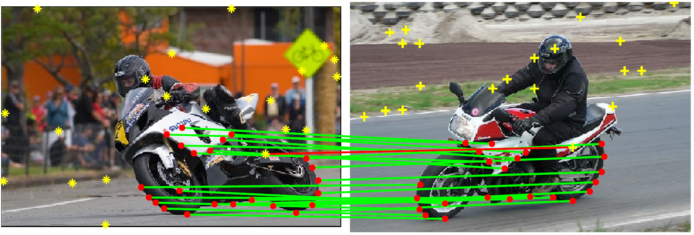

# ZAC: Zero-Assignment Constraint for Graph Matching with Outliers
Implementation for the [CVPR2020 paper](http://openaccess.thecvf.com/content_CVPR_2020/papers/Wang_Zero-Assignment_Constraint_for_Graph_Matching_With_Outliers_CVPR_2020_paper.pdf).

[Supplementary materials](http://openaccess.thecvf.com/content_CVPR_2020/supplemental/Wang_Zero-Assignment_Constraint_for_CVPR_2020_supplemental.pdf)
 
 ## Abstract
 This work focuses on the problem of graph matching in the presence of outliers, based on the zero-assignment constraint. This repository consists of the code of our work ZAC/ZACR (ZAC with regularization) and the compared graph matching and point registration methods.
 
<p align="center">

<p>
 
 ## Details
 - Download the data from [Google Drive](https://drive.google.com/file/d/1-b_d_mMnyn7a7SwPsQOukk6ofTrHfw31/view?usp=sharing), then unzip it to replace the "data/" folder existed.
 - The compared graph matching methods and point registration methods can be found in directories "src/GM_methods" and "src/PR_methods", respectively.
 - Run the demos to see some examples on the used datasets.
 
 ## Citation
 If you find our work useful please consider citing:
```
@inproceedings{ZAC,
title = "Zero-Assignment Constraint for Graph Matching with Outliers",
author = "Fudong Wang and Nan Xue and Jin-Gang Yu and Gui-Song Xia",
booktitle = "IEEE Conference on Computer Vision and Pattern Recognition (CVPR)",
year = {2020},
}
```
